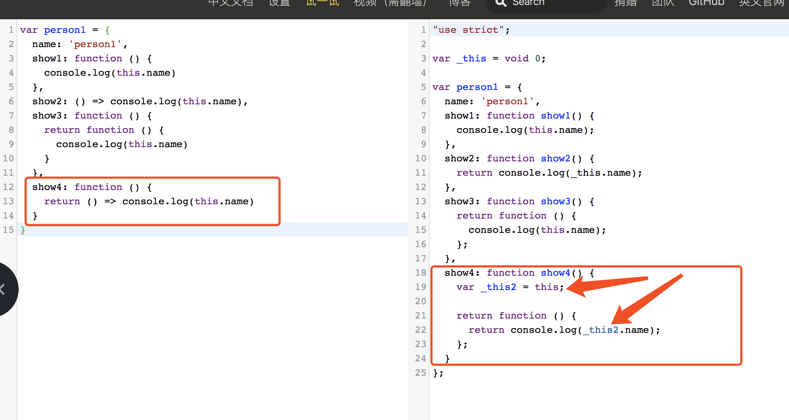
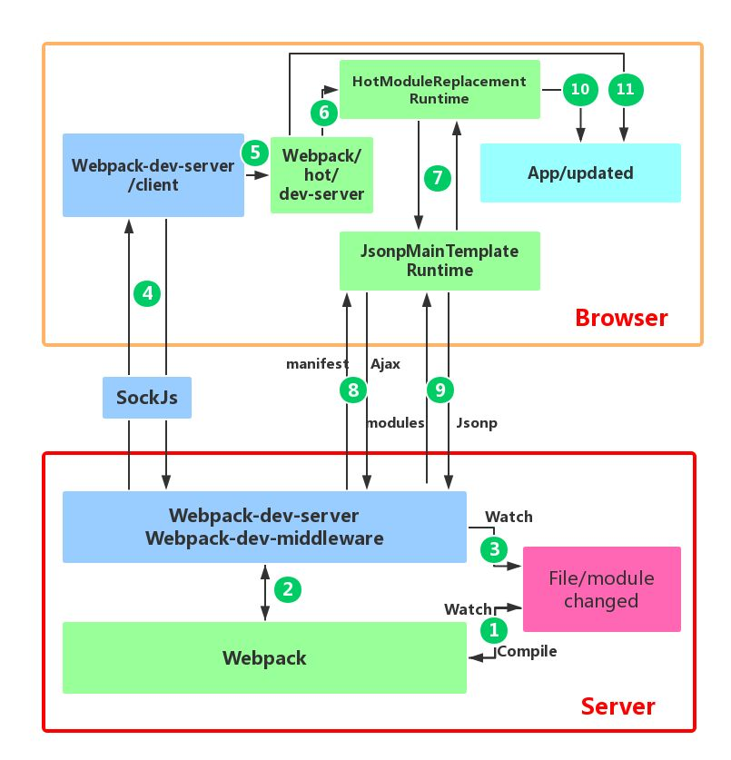

# 2020-5-14
### 按需加载
1. 静态分析 import
2. 路由通过import().then(动态的)实现**按需加载**

### js作用域

### webpack流程
[webpack编译流程 - 掘金](https://juejin.im/post/5d70b186f265da03e1689864)
1.读取配置 -> 初始化配置 -> 确定入口 -> 遍历依赖 -> loader转化 -> 生成依赖关系表 -> 根据依赖关系表和初始配置分离chunk -> 输出文件

期间，在webpack不同的生命周期中，调用不同的插件，增强功能

### webpack 优化
[辛辛苦苦学会的 webpack dll 配置，可能已经过时了 - 掘金](https://juejin.im/post/5d8aac8fe51d4578477a6699)
1. 缓存 HardSourceWebpackPlugin:
1.把公共代码打包为 DLL 文件存到硬盘里
2.第二次打包时动态链接 DLL 文件，不重新打包
3.打包时间缩短
2. 利用多核cpu
1.开启多进程loader转换 HappyPack:（loader是最耗时的操作）
2.开启多进程压缩：ParallelUglifyPlugin:

### webpack devserver
[Webpack HMR 原理解析 - 知乎](https://zhuanlan.zhihu.com/p/30669007)

#工作/技术
